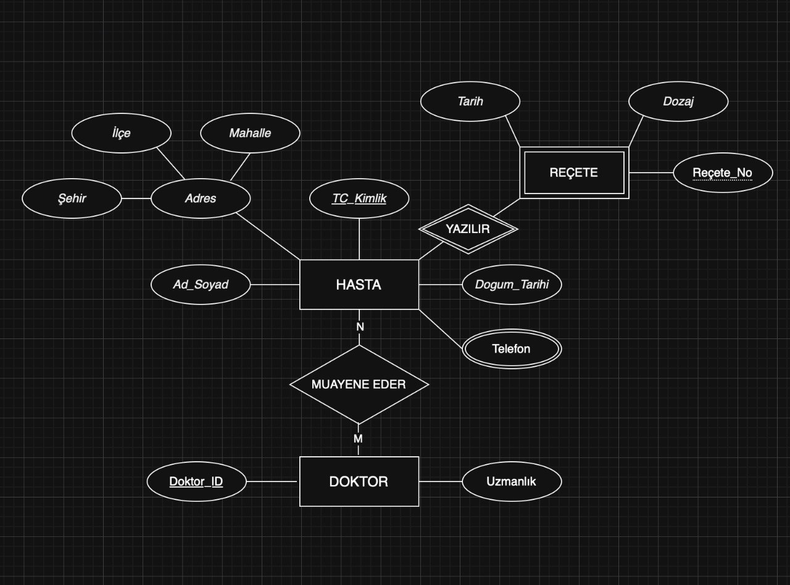
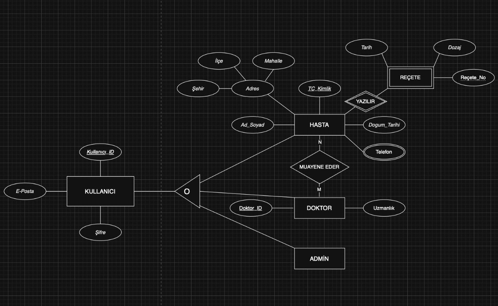
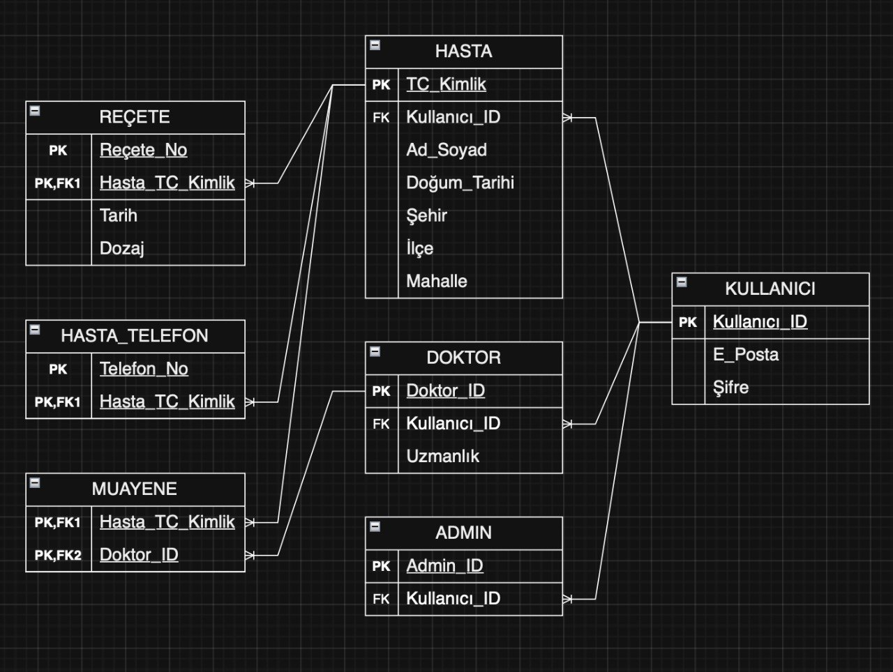

# Smart Healthcare Database Management System

## 📌 Project Overview
Welcome to my Smart Healthcare Database project! I designed and developed this relational database system for my *Data Management and File Structures* course. 

The goal was to move beyond simple queries and architect a fully scalable, multi-user system that mimics real-world hospital operations—handling everything from doctor appointments and patient medical histories to complex prescriptions.

## 🚀 Architectural Design & Normalization
Building a robust database starts with a solid mathematical foundation. Here is how I structured the schema:
* **EER Modeling:** Mapped out the complex entities and relationships using Enhanced Entity-Relationship diagrams.
* **Strict BCNF Normalization:** To eliminate data redundancy and prevent insertion/deletion anomalies, I analyzed the Functional Dependencies (FDs) and normalized the entire database schema all the way up to **Boyce-Codd Normal Form (BCNF)**.

## 🧠 Indexing Strategy & Performance
As datasets grow, sequential table scans kill query performance. To optimize disk I/O operations, I implemented mathematically appropriate file structures:
* **B+ Tree Indexing:** Applied to the `Ad_Soyad` (Name_Surname) attribute to drastically speed up alphabetical sorting and range-based queries.
* **Hash Indexing:** Applied to the `TC_Kimlik` (National ID) attribute. Since national IDs are unique and only used for exact-match lookups, the Hash index reduces the search time complexity to a constant $O(1)$.

## 📊 Advanced Analytical Queries
Creating tables is the easy part; extracting meaningful business intelligence is the real challenge. I authored a dedicated `queries.sql` script featuring 10 advanced analytical queries to test the limits of the relational engine. These include:
* Multi-table `INNER` and `LEFT OUTER JOIN`s to reconstruct patient histories.
* `GROUP BY` and `HAVING` aggregations to segment high-risk patients.
* Complex nested subqueries, derived tables, and `EXISTS` conditions to analyze prescription correlations.

## 🗂 Repository Structure
* `hospital_database_schema.sql`: The main dump containing the BCNF table constraints (`PRIMARY KEY`, `FOREIGN KEY`) and initial mock data insertions.
* `queries.sql`: The dedicated script containing the advanced analytical SQL statements.
* `DBMS Homework.pdf`: The theoretical specifications, including my formulations in **Relational Algebra** and **Tuple Relational Calculus**.

## 📊 Database Design & Schemas
To visualize the underlying data architecture, I have provided the following key diagrams:

* **ER Diagram:** Conceptual view of entities and their primary connections.
* **EER Diagram:** Enhanced view detailing complex relationships within the healthcare system.
* **Relational Schema:** The final normalized design mapping the structural flow of data.

| ER Diagram | EER Diagram | Relational Schema |
| :---: | :---: | :---: |
|  |  |  |
